# Inteli - Instituto de Tecnologia e Liderança

<p align="center">
  
</p>
<br>

# Projeto de arquitetura de software

Nome do Parceiro: Meta

Nome do Projeto: Verse

Nome do Grupo: Verse

Integrantes do grupo: Carolina Fricks, Emanuel Costa, Felipe Saadi, Julia Togni, Livia Bonotto, Marcelo Feitoza e Mateus Neves

**Conteúdo**

-   [Dados da empresa](#dados-da-empresa)
-   [O problema](#o-problema)
-   [Processo de negócio e fluxos críticos suportados pelo sistema](#processo)
-   [Volumetrias](#volumetrias)
-   [Estratégia de crescimento estabelecida](#estratégia-de-crescimento-estabelecida)
-   [Riscos e oportunidades](#riscos-e-oportunidades)
-   [Matriz de riscos](#matriz-de-riscos)
-   [Oportunidade de melhoria](#oportunidade-de-melhoria)
-   [Modelo de simulação do atual](#modelo-de-simulação-do-atual)
-   [Artefato 2](#artefato-2)
-   [Requisitos não funionais do sistema novo](#requisitos-não-funionais-do-sistema-novo)
-   [Mapeamento dos requisitos](#mapeamento-dos-requisitos)
-   [Justificativa](#justificativa)
-   [Artefato 3](#artefato-3)
-   [Estrutura estática do modelo](#estrutura-estática-do-modelo)
-   [Modelagem comportamental e simulação de pelo menos um RNF](#modelagem-comportamental-e-simulação-de-pelo-menos-um-rnf)
-   [Análise de Resultados - Testes](#análise-de-resultados---testes)
-   [Documentação Final do Projeto](#documentação-final-do-projeto)
-   [Referências](#referências)
-   [Apêndice](#apêndice)

<br>

# Sprint 1

## Dados da empresa

Fundada em 2004 por Mark Zuckerberg e alguns colegas de quarto da Universidade de Harvard, a empresa inicialmente começou como uma plataforma de rede social chamada "Facebook". Ao longo dos anos, expandiu-se rapidamente e se tornou uma das maiores empresas de tecnologia do mundo. Em 2021, a empresa obteve um lucro de 150 bilhões de dólares e tiveram um gasto de aproximadamente 50 milhões de dólares em compras.

Seus principais produtos são:

-   **Facebook**: Uma das maiores redes sociais do mundo, com aproximadamente 2,8 bilhões de usuários mensais ativos.
-   **WhatsApp**: Um aplicativo de mensagens instantâneas muito popular, com mais de 2 bilhões de usuários.
-   **Instagram**: Uma plataforma de compartilhamento de fotos e vídeos, com mais de 1 bilhão de usuários.
-   **Messenger**: O serviço de mensagens do Facebook.
-   **Oculus**: Uma linha de produtos de realidade virtual.
-   **Workplace**: Uma plataforma de comunicação para empresas.

Em 2021, o Facebook anunciou uma rebranding da empresa para "Meta Platforms, Inc.". Esta mudança refletiu o novo foco da empresa na construção de um "metaverso" – uma convergência de espaços virtuais interconectados usando realidade virtual (VR), realidade aumentada (AR) e outras tecnologias.

## O problema

O setor de Supply Chain é vital para a operação da empresa, responsável pelo gerenciamento da aquisição de materiais, como insumos para a fabricação de produtos, equipamentos de escritório, etc. Além da logística, este departamento também mantém relações estreitas com os fornecedores. Uma das tarefas primordiais do setor é a análise de dados de compras para descobrir oportunidades de otimização e avaliar a necessidade de novos pedidos. Entretanto, um obstáculo tem sido a classificação desses dados, que atualmente apresenta uma precisão de 65%, tornando as análises propensas a erros.

O processo de aquisição começa com uma solicitação feita pelo usuário, seguida de uma classificação inicial que leva à ordem de compra. Uma vez aprovada, a ordem é enviada ao fornecedor, que emite uma nota fiscal com novas classificações. É neste estágio que uma Inteligência Artificial atua para reclassificar as compras, fornecendo aos especialistas em Supply os dados para análises mais detalhadas.

A principal preocupação atual é a baixa precisão de 65% nas classificações, já que compromete a identificação de padrões de gastos, também pode gerar aumento de custos, afetar a relação com os fornecedores e resultar em problemas de conformidade e auditoria, além de diversos outros impactos.

Com isso, o desafio a ser enfrentado é o de elevar essa taxa de precisão, redesenhando a arquitetura atual e garantindo uma maior qualidade do software e do processo.

## Processo de negócio e fluxos críticos suportados pelo sistema

#### Processo de negócio (atual)

O fluxograma apresentado descreve as etapas chave do processo de compras da Meta atualmente.

.png>)<br>

 O processo inicia-se com o funcionário utilizando a funcionalidade de 'Guided Buying' para criar um 'Request' (pedido). Uma vez que o pedido é colocado, ele necessita da aprovação de diferentes departamentos, indicados no diagrama como 'Financeiro' e 'Jurídico', antes de prosseguir. Após receber as aprovações necessárias, o pedido avança para a fase de 'Invoice', onde as faturas são geradas e, por fim, encaminhadas para o módulo de 'IA', onde são classificadas.
 
#### Processo detalhado do sistema

O diagrama a seguir oferece uma visão estruturada do processo de aquisição de bens e serviços dentro do sistema da Meta. Ele detalha as etapas, desde o momento em que um funcionário inicia um pedido até a conclusão do processo.

.png>)

O diagrama apresentado ilustra o processo detalhado do sistema para fazer solicitações de compras são administradas dentro do sistema corporativo. Primeiro, um colaborador ativa o processo por meio da funcionalidade 'Guided Buying', estabelecendo a natureza da aquisição como um bem ou serviço. Posteriormente, o sistema exige a identificação do responsável pelo pedido e o registro da data, assegurando a atribuição de propriedade e temporalidade ao processo. Segue-se a hierarquização do pedido em categorias primárias e secundárias, desdobrando-se em subcategorias para uma classificação precisa. O orçamento é definido, fundamentando a seleção subsequente do fornecedor. Uma vez confirmada a escolha do fornecedor, o pedido é considerado completo, marcando a conclusão do fluxo de compra dentro do ambiente sistêmico.

#### Fluxos críticos suportados pelo sistema

Considerando as limitações atuais do sistema da Meta:

1. <h4>Recepção de pedidos limitados com verificação restrita:</h4> O sistema recebe um máximo de 30 ordens de compra simultâneas, cada uma passando por uma verificação limitada de autenticidade e integridade.

2. <h4>Categorização limitada com 65% de acurácia:</h4> As ordens de compra são categorizadas com uma precisão limitada de 65%, o que pode resultar em uma categorização imprecisa para algumas das ordens recebidas.

3. <h4>Processamento em tempo real limitado:</h4> O sistema processa e registra as ordens de compra categorizadas com uma precisão de 65%, ou seja são registrados documentos categorizados de maneira errada.

4. <h4>Exibição limitada da confiança da categorização devido à precisão reduzida:</h4> A taxa de confiança da categorização exibida reflete a limitação de 65% de precisão, fornecendo informações limitadas sobre a confiabilidade das categorias atribuídas.

## Diagrama de componentes

Este diagrama representa os principais componentes do sistema atual que fazem parte do fluxo de compras.
O módulo Buy@ é o sistema onde são feitas as solicitações de compra pelo usuário, o sistema de Invoices recebe as notas fiscais enviadas pelo fornecedor, e o módulo de Inteligência Artificial realiza Taxonomia do pedido.


A interação começa quando o usuário faz uma solicitação de compra através do módulo Buy@. Essa solicitação é então processada pelo módulo de Inteligência Artificial, que aplica uma taxonomia ao pedido para classificá-lo adequadamente. Ao mesmo tempo, o sistema de Invoices, que recebe as notas fiscais do fornecedor, assegura que a documentação fiscal corresponda aos pedidos realizados. Este fluxo entre os componentes é crucial para a integridade do processo de compra, garantindo que as solicitações dos usuários sejam atendidas de maneira eficiente e que a documentação fiscal seja processada corretamente, proporcionando uma base sólida para análises futuras e conformidade fiscal.

## Volumetrias

1.  **Principais Áreas de Gastos:**

    -   "Professional Services", "Sales, Marketing & Events" e "Manufacturing" lideram em termos de gastos. Isso sugere um foco significativo em serviços profissionais, vendas, marketing e eventos, e operações de fabricação.

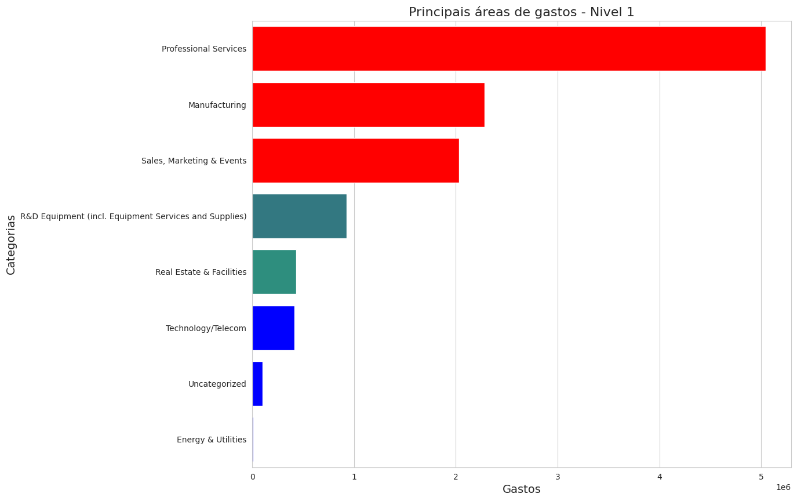

2.  **Investimento em Pesquisa e Desenvolvimento (R&D):**

    -   A categoria "R&D Equipment (incl. Equipment Services and Su...)" indica um investimento considerável em pesquisa e desenvolvimento. Isso pode incluir aquisição de equipamentos, serviços relacionados e suporte.

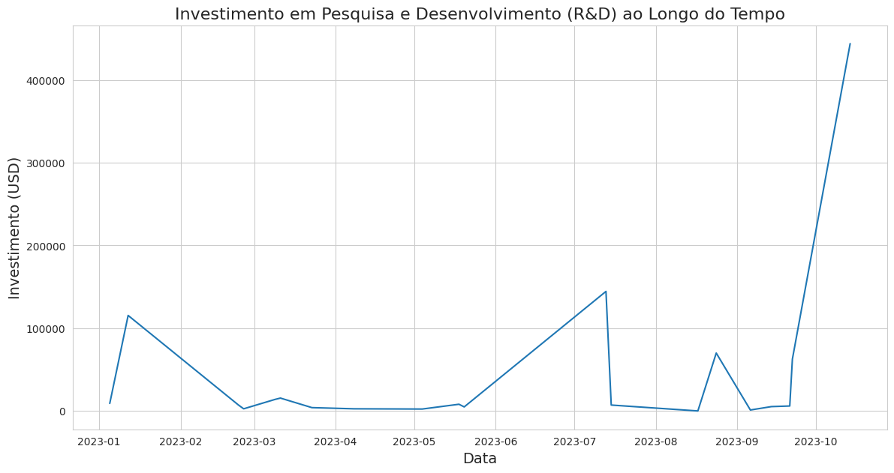

3.  **Despesas em Tecnologia/Telecom e Infraestrutura:**

    -   "Technology/Telecom" e "Real Estate & Facilities" representam áreas importantes de gastos, indicando investimentos em tecnologia, telecomunicações e infraestrutura imobiliária.

    

4.  **Custos Associados a Energia & Utilidades:**

    -   A categoria "Energy & Utilities" representa despesas relacionadas a energia e serviços públicos, mostrando uma consideração para custos operacionais essenciais.

5.  **Serviços Profissionais e Categorias Não Classificadas:**

    -   "Professional Services" representa gastos em serviços profissionais, enquanto a categoria "Uncategorized" sugere despesas que ainda precisam ser classificadas adequadamente.

6.  **Áreas Potenciais para Otimização de Custos:**

    -   A análise destes dados pode revelar áreas onde otimização de custos pode ser explorada, especialmente em "Uncategorized" e em categorias com valores menores.


7. **Enfoque em Serviços Profissionais**:

    - O gráfico mostra que as despesas mais elevadas são com "Professional Services", indicando um foco considerável em atividades ou serviços profissionais, que podem incluir consultoria, auditoria, entre outros. A categoria "Manufacturing", embora tenha despesas significativas, não é a maior em comparação com "Professional Services".

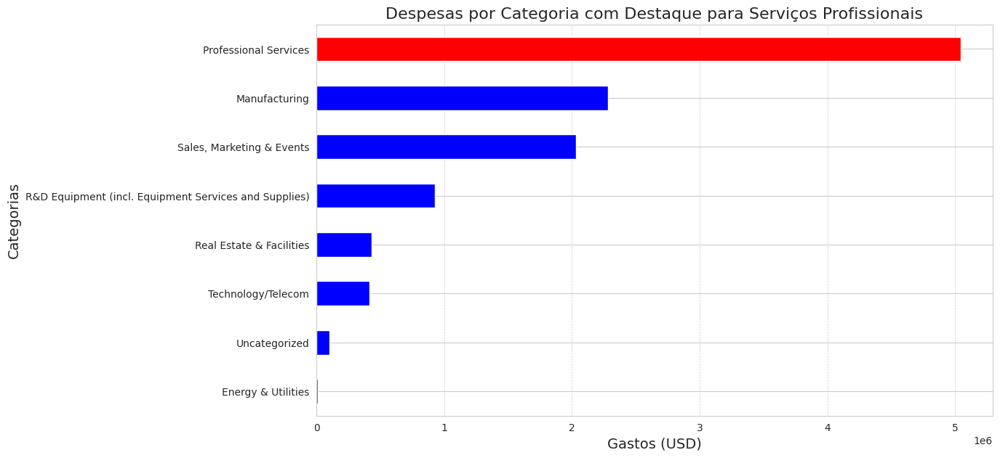

<br>

1. **Principais Categorias de Gastos:**

    - "Contract Manufacturing" lidera em termos de gastos, totalizando aproximadamente $1.52 milhões.
    - A categoria "Original Content" vem em segundo lugar, com cerca de $1.14 milhões.

2. **Diversidade de Categorias de Nível 2:**

    - As categorias abrangem uma variedade de áreas, desde "Contract Manufacturing" até "Network Hardware", refletindo a diversidade de despesas na empresa.

3. **Gastos em Pesquisa e Desenvolvimento (R&D):**

    - Há uma presença significativa de gastos relacionados a pesquisa e desenvolvimento, como "R&D Processing Equipment" e "R&D Test, Measurement & Inspection Equipment".

4. **Categorias Não Classificadas:**

    - Similar aos dados de nível 3, existe uma categoria chamada "Uncategorized" que representa gastos de aproximadamente $23.65 mil. Pode ser importante investigar e categorizar esses gastos para uma análise mais detalhada.

5. **Outras Categorias Relevantes:**
    - "Software & Support", "Full Service Creative Agency", e "Construction" também representam valores significativos.

<br>

<center>
  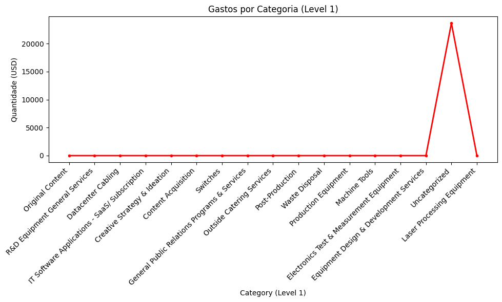
</center>
<br>

1. **Maiores Gastos:**

    - A categoria com o maior gasto é "Production Equipment", totalizando aproximadamente $1.52 milhões.
    - Em seguida, temos "Original Content" com cerca de $1.14 milhões e "Machine Tools" com aproximadamente $361.14 mil.

2. **Diversidade de Categorias:**

    - As categorias abrangem uma variedade de áreas, desde equipamentos de produção até serviços de catering externo, demonstrando a diversidade de despesas.

3. **Gastos Menores:**

    - Algumas categorias representam gastos relativamente menores, como "Laser Processing Equipment" com cerca de $7.13 mil, e "Switches" com cerca de $4.59 mil.

4. **Categorias Não Classificadas:**
    - Existe uma categoria chamada "Uncategorized" que representa gastos de aproximadamente $23.65 mil. Pode ser interessante investigar e categorizar esses gastos para uma análise mais detalhada.

Essa análise preliminar fornece uma visão geral dos gastos em diferentes categorias. Assim obtemos uma representação mais intuitiva e comparativa dos gastos em diferentes categorias.

<br>

<center>
  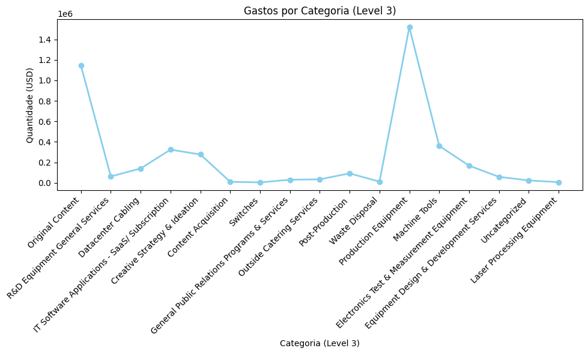
</center>
<br>

# Riscos e oportunidades

## Matriz de riscos

<center>
  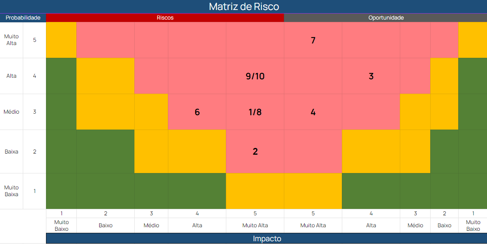
</center>

1 - Ineficiência na classificação dinâmica de dados, com assertividade abaixo de 95%

2 - Stakeholders perderem o interesse no produto.

3 - Melhoria na área de compras, deixando-a mais dinâmica.

4 - Implementação do projeto por parte da Meta.

5 - Erros de Classificação de Dados.

6 - Stakeholders estarem alinhados.

7 - Integrantes do grupo ganharem conhecimento em arquiteturas.

8 -   O sistema não ser capaz de analisar os diferentes padrões dos dados fazendo com que não tenha a categorização correta das ordens de compra em múltiplas linguagens.

9 - O sistema não estar disponivel 100% do tempo.

10 - O sistema não ser seguro.

# Modelo de simulação do atual

Para simular o sistema atual, desenvolvemos uma aplicação em Flask com as características identificadas do sistema no levantamento de requisitos feito com o parceiro.

Utilizamos os seguintes critérios:

-   Acesso limitado à 30 solicitações simultâneas
-   Precisão de 65% na categorização de ordens de compra


Como vemos na demonstração, o sistema atual é capaz de lidar com até 30 solicitações simultâneas e sua média de taxa de acerto na categorização é por volta de 65%. Ao receber um número de solicitações acima de 30 o sistema entre em um estado de falha, não conseguindo lidar com a carga demandada.

Com essa simulação é possível identificar as principais necessidades de melhoria do sistema atual, que serão resolvidas pelo nosso novo sistema a ser desenvolvido ao longo do projeto.

# Requisitos não funcionais do sistema novo

## Mapeamento dos requisitos

#### Requisitos não funcionais com vulnerabilidades identificadas no sistema atual:

-   Acesso limitado a 30 solicitações simultâneas: Isso pode resultar em longos tempos de espera e interrupções no serviço, afetando a experiência do usuário e a eficiência operacional.
-   Precisão de 65% na categorização de ordens de compra: Isso pode levar a erros na classificação das ordens de compra, resultando em planejamento deficiente, gastos ineficientes e falta de visibilidade nos gastos da organização.

<br>

#### Requisitos críticos a serem focados para o projeto:

-   Melhoria na escalabilidade: Aumentar o número de solicitações simultâneas aceitas para melhorar a capacidade de lidar com picos de tráfego e garantir um serviço contínuo e confiável.
-   Aprimoramento na precisão de categorização: Elevar a precisão na categorização das ordens de compra para mais de 80% para permitir um planejamento de gastos mais eficiente e uma compreensão aprofundada dos padrões de compra, levando a decisões mais informadas e estratégicas.

| RNF                                                                                                                                                                                     | Elementos Envolvidos                                                                             | Serviços Sugeridos                                           |
| --------------------------------------------------------------------------------------------------------------------------------------------------------------------------------------- | ------------------------------------------------------------------------------------------------ | ------------------------------------------------------------ |
| RNF1: O sistema deve ser capaz de processar 3000 ordens de compra simultâneas, sem interrupção do sistema. 90% dessas ordens devem ser processadas em até 3 minuto.                     | Sistema de fila, Sistema de processamento paralelo, Sistema de classificação de ordens de compra | Kafka, Amazon EC2, Microsoft Azure Machine Learning          |
| RNF2: O sistema deve garantir uma precisão de 80% na categorização de ordens de compra, além de exibir a taxa de confiança da categorização efetuada (em porcentagem).                  | Algoritmo de classificação de ordens de compra, Sistema de interface do usuário                  | Amazon SageMaker, Microsoft Azure Machine Learning, React.js |
| RNF3: Classificar a taxa de confiança em níveis: Certeza (a partir de 80% de confiança), Alta confiança (entre 65% e 80% ) e Baixa confiança (de 0 à 65%)                               | Algoritmo de taxa de confiança e Sistema de interface do usuário                                 | -                                                            |
| RNF4: O sistema deve garantir que os dados sejam protegidos contra acesso não autorizado. Para isso deve ser permitido apenas o acesso por meio das credenciais institucionais da Meta. | Sistema de autenticação e autorização                                                            | Auth0, Okta                                                  |
| RNF5: Implementar um sistema de logs para garantir a rastreabilidade e monitoramento do status do sistema em tempo real.                                                                | Sistema de logs, Sistema de monitoramento                                                        | Datadog                                                      |
| RNF 6: O sistema deve ser capaz de analisar os diferentes padrões dos dados, garantindo a categoriazação correta das ordens de compra em múltiplas linguagens.                          | Algoritmo de NLP                                                                                 | -                                                            |

<br>

### Justificativa dos requisitos:

| Número RNF | Justificativa                                                                                                                                                                                                                                                                                                                                                                                                                                                                                                                                                                                                                                                 |
| ---------- | ------------------------------------------------------------------------------------------------------------------------------------------------------------------------------------------------------------------------------------------------------------------------------------------------------------------------------------------------------------------------------------------------------------------------------------------------------------------------------------------------------------------------------------------------------------------------------------------------------------------------------------------------------------- |
| RNF1       | O aumento no processamento simultâneo das ordens de compra visa atender a demanda crescente e garantir que o sistema possa lidar com picos de tráfego, proporcionando uma experiência contínua e sem interrupções para os usuários. Isso eliminaria a restrição anterior de 30 solicitações simultâneas e melhoraria a eficiência operacional de acordo com a projeção de crescimento de compras. Além disso, reduzir o tempo de processamento para 90% das ordens de compra em até 1 minuto visa melhorar a eficiência operacional e a satisfação do cliente, eliminando a demora no processamento que afetava a experiência do usuário no sistema anterior. |
| RNF2       | Aumentar a precisão na categorização das ordens de compra para 80% é essencial para garantir uma compreensão mais precisa e abrangente dos gastos da organização, eliminando erros de categorização que anteriormente resultavam em planejamento deficiente e gastos ineficientes.                                                                                                                                                                                                                                                                                                                                                                            |
| RNF3       | O sistema atual não possui faixas de confiança, a divisão em faixas de confiança fornece uma camada adicional de informação que pode ser crucial para a tomada de decisões, gestão de riscos e otimização de processos.                                                                                                                                                                                                                                                                                                                                                                                                                                       |
| RNF4       | Reforçar a segurança do sistema por meio de autenticação e autorização robustas visa eliminar a vulnerabilidade identificada de acesso não autorizado, garantindo que apenas usuários autorizados possam acessar o sistema e protegendo os dados sensíveis de possíveis violações.                                                                                                                                                                                                                                                                                                                                                                            |
| RNF5       | A implementação de um sistema de logs abrangente permitirá o monitoramento contínuo do sistema em tempo real, eliminando a lacuna anterior na rastreabilidade das atividades e melhorando a capacidade de identificar possíveis vulnerabilidades e anomalias no sistema.                                                                                                                                                                                                                                                                                                                                                                                      |
| RNF6       | Esse requisito atende à necessidade do parceiro de garantir a rastreabilidade dos dados imputados manualmente e automaticamente, além de ser fundamental para a segurança, otimização e gestão eficaz de qualquer sistema.                                                                                                                                                                                                                                                                                                                                                                                                                                    |

<br>

## Estrutura estática do modelo:

#### Modelo Antigo

<center>
  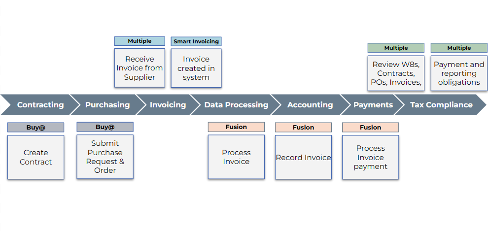
</center>

#### Modelo Atual

<center>
  
</center>
<br>

<br>
<h4>Estrutura e conexão entre esses elementos - Detalhamento do modelo de simulação de cada RNF que justifique o foco selecionado na parametrização.</h4><br>
<b>DISPONIBILIDADE E DESEMPENHO:</b><br>
<b>Estrutura:</b> O sistema deve ter um balanceador de carga conectado a vários servidores de processamento, cada um equipado com mecanismos de cache e capacidade de processamento otimizada. Além disso, deve haver um sistema de monitoramento em tempo real para acompanhar o status de processamento das ordens de compra.<br>
<b>Conexão:</b> O balanceador de carga distribui as ordens de compra entre os servidores de processamento, que utilizam o mecanismo de cache para acelerar o processamento. O sistema de monitoramento em tempo real garante que os administradores possam acompanhar o desempenho do sistema e identificar possíveis gargalos de processamento.<br>

<br><b>PRECISÃO NA CATEGORIZAÇÃO:</b>
<b>Estrutura:</b> O sistema será reforçado com algoritmos de aprendizado de máquina e processamento de linguagem natural (NLP) robustos, que serão constantemente alimentados com conjuntos de dados de treinamento diversificados. Esses algoritmos serão aprimorados para avaliar a precisão das categorizações por meio de verificações periódicas, permitindo um aprendizado contínuo e adaptativo da máquina.
<b>Conexão:</b> Os algoritmos de aprendizado de máquina e NLP serão alimentados com dados de treinamento multilíngues e conectados ao sistema de classificação de confiança. Esse sistema atribui um nível de confiança a cada categorização e garantirá que as ordens de compra sejam categorizadas com base em critérios específicos de confiabilidade.

<b>SEGURANÇA:</b>
<b>Estrutura:</b> O sistema contará com protocolos avançados de autenticação e controle de acesso, juntamente com criptografia robusta para proteger os dados contra acessos não autorizados. Além disso, um sistema de monitoramento de segurança em tempo real estará ativo para detectar tentativas de acesso suspeitas.
<b>Conexão:</b> Os protocolos de autenticação e controle de acesso estarão integrados ao sistema de criptografia para garantir que apenas usuários autorizados com credenciais válidas possam acessar o sistema. O sistema de monitoramento de segurança em tempo real estará conectado a esses protocolos para detectar quaisquer violações de segurança e atividades suspeitas.

<b>RASTREABILIDADE E ANÁLISE DE DADOS MULTILÍNGUES:</b>
<b>Estrutura:</b> O sistema utilizará uma combinação de sistemas de registro de auditoria, mecanismos de rastreamento de transações e análise de padrões de dados multilíngues para garantir a rastreabilidade e a precisão na categorização. Um sistema de logs abrangente será implementado para registrar todas as atividades do sistema em tempo real.
<b>Conexão:</b> Os sistemas de registro de auditoria e rastreamento de transações estarão interligados aos algoritmos de análise de padrões de dados multilíngues, garantindo uma categorização precisa e rastreabilidade de todas as ordens de compra. O sistema de logs abrangente estará conectado a esses sistemas para registrar todas as transações e atividades do sistema para fins de monitoramento e auditoria.<br>

<b>Desacoplamento do sistema:</b> o sistema é configurado com estratégias de desacoplamento, permitindo que diferentes partes do sistema operem de forma independente. Evidenciamos isso pela utilização de sistemas separados para funções específicas, como o sistema de monitoramento em tempo real e o sistema de logs abrangente. O desacoplamento eficaz garante que as diferentes funcionalidades possam evoluir separadamente, facilitando a manutenção e a expansão do sistema com mínimos impactos nas outras partes.

</details>

## Modelagem comportamental e simulação de pelo menos um RNF

### Simulações idealizadas para o aperfeiçoamento do sistema atual

| RNF                                             | Simulação                                               | Nível de Simulação                            | Melhoria                                                                                                                                                                                                                                                                                                                              |
| ----------------------------------------------- | ------------------------------------------------------- | --------------------------------------------- | ------------------------------------------------------------------------------------------------------------------------------------------------------------------------------------------------------------------------------------------------------------------------------------------------------------------------------------- |
| Disponibilidade e Desempenho                    | Processamento simultâneo de 3000 ordens de compra       | Testes de estresse do sistema                 | Otimização de recursos de processamento, balanceamento de carga e aumento da capacidade de processamento para garantir 90% das ordens processadas em até 1 minuto.                                                                                                                                                                    |
| Precisão na Categorização                       | Categorização de ordens de compra com taxa de confiança | Utilização de conjuntos de dados de teste     | Aprimoramento dos algoritmos de categorização e implementação de técnicas de aprendizado de máquina para melhorar a precisão da categorização para 80%, classificando as categorizações em diferentes níveis de confiança.                                                                                                            |
| Segurança                                       | Tentativas de acesso não autorizado ao sistema          | Testes de penetração e ataques simulados      | Reforço das medidas de autenticação e controle de acesso, implementação de criptografia avançada e monitoramento de segurança contínuo para garantir acesso apenas por meio das credenciais institucionais da Meta.                                                                                                                   |
| Rastreabilidade e Análise de Dados Multilíngues | Análise de padrões de dados em diferentes idiomas       | Utilização de conjuntos de dados multilíngues | Implementação de técnicas avançadas de processamento de linguagem natural (NLP) e algoritmos de análise de padrões para garantir uma categorização precisa das ordens de compra em vários idiomas. Estabelecimento de um sistema de logs abrangente para garantir rastreabilidade e monitoramento em tempo real do status do sistema. |

### Simulação RNF no sistema novo

#### Simulação RNF 01

Simulamos nosso sistema apresentando uma melhoria na capacidade de processamento simultâneo

Utilizamos os seguintes critérios:

-   Aumento de 30 acessos simultâneos para 3000 acessos simultâneos
-   Se mantem a precisão de 65% na categorização de ordens de compra


Como vemos na demonstração, o sistema é capaz de lidar com até 3000 solicitações simultâneas e sua média de taxa de acerto na categorização é por volta de 65%. Ao receber um número de solicitações acima de 3000 o sistema entre em um estado de falha, não conseguindo lidar com a carga demandada.

Com essa simulação é possível identificar a aplicação do RNF01, que será implementada ao longo do projeto.

#### Simulação RNF 02

Simulamos nosso sistema apresentando uma melhoria na precisão da categorização de ordens de compra

Utilizamos os seguintes critérios:

-   Acesso limitado à 30 solicitações simultâneas
-   Aumento da precisão de 65% para 80% na categorização de ordens de compras


Como vemos na demonstração, o sistema é capaz de lidar com até 30 solicitações simultâneas e sua média de taxa de acerto na categorização é por volta de 80%. Ao relizar o processamento das ordens de compra, o sistema é capaz de ser mais preciso em sua categorização de ordens de compras, resultando em uma capacidade maior de compreensão dos dados.

Com essa simulação é possível identificar a aplicação do RNF02, que será implementada ao longo do projeto.

#### Simulação RNF 04

Simulamos nosso sistema apresentando uma melhoria na segurança da aplicação

Utilizamos os seguintes critérios:

-   Acesso permitido apenas para usuários com e-mail Meta


Como vemos na demonstração, o sistema só é possível de ser acessado por uma conta meta. Ao tentar realizar o login com e-mails não autorizados o sistema não permite o acesso, garantindo assim a segurança do sistema

Com essa simulação é possível identificar a aplicação do RNF04, que será implementada ao longo do projeto.

---

# Sprint 2

## Arquitetura do Sistema Atual

| RNF                                                                                                                                                                                         |
| ------------------------------------------------------------------------------------------------------------------------------------------------------------------------------------------- | --- |
| RNF1:O sistema deve garantir uma disponibilidade de 99%, mantendo a capacidade de processar até 30 documentos por minuto com a qualidade entre 80% e 90% da classificação.                  |
| RNF2: O sistema deve garantir uma precisão de 65% na categorização de ordens de compra, além de exibir a taxa de confiança da categorização efetuada (em porcentagem).                      |
| RNF3: O sistema deve ser capaz de processar e classificar eficientemente faturas em diversos formatos, incluindo PDF, imagens digitalizadas e outros formatos comuns de faturas eletrônicas |
| RNF4: O sistema deve garantir que os dados sejam protegidos contra acesso não autorizado. Para isso deve ser permitido apenas o acesso por meio das credenciais institucionais da Meta.     |
| RNF5: Implementar um sistema de logs para garantir a rastreabilidade e monitoramento do status do sistema em tempo real.                                                                    | -   |

## Mapeamento dos requisitos

| **Requisito de Escalabilidade (RNF1):** |                                                                                                                                                                                                                                                                                                                                                                                                                                                                                                                                         |
| --------------------------------------- | --------------------------------------------------------------------------------------------------------------------------------------------------------------------------------------------------------------------------------------------------------------------------------------------------------------------------------------------------------------------------------------------------------------------------------------------------------------------------------------------------------------------------------------- |
| **Entrada:**                            | Sistema sem medição de disponibilidade, evasão e qualidade.                                                                                                                                                                                                                                                                                                                                                                                                                                                                             |
| **Saída:**                              | A saída desejada é o sistema processar 30 documentos por minuto com uma taxa de confiabiilidade entre 80% e 90%, estando disponivel 99% do tempo.                                                                                                                                                                                                                                                                                                                                                                                       |
| **Abordagem de Controle:**              | Teste de estresse para garantir a disponibilidade primeiro com uma carga baixa e depois aumentando até atingir o limite, teste de performace para medir a evasão testando com diferentes volumes para garantir que o sistema mantenha a performance necessária mesmo sob carga máxima. Teste automatizado para garantir a acertividade da classificação. E quando o sistema estar no ar pode ser medido registrando o tempo de inatividade e o tempo de atividade durante um período definido (por exemplo, mensalmente ou anualmente). |

| **Requisito de Precisão na Categorização (RNF2):** |                                                                                                                                                                                                                                                                                                               |
| -------------------------------------------------- | ------------------------------------------------------------------------------------------------------------------------------------------------------------------------------------------------------------------------------------------------------------------------------------------------------------- |
| **Entrada:**                                       | Para alcançar a precisão desejada, o sistema requer informações específicas, incluindo a identificação do bem ou serviço (0 ou 1 durante o treinamento), a data da compra e o nome do funcionário solicitante. Esses dados são essenciais para aprimorar a categorização e garantir resultados mais precisos. |
| **Saída:**                                         | A saída desejada é alcançar uma precisão de 80% na categorização, exibindo a taxa de confiança associada.                                                                                                                                                                                                     |
| **Abordagem de Controle:**                         | É possivel medir a taxa de precisão configurando o sistema para registrar cada categorização de ordem de compra que realiza, juntamente com a taxa de confiança associada a cada uma.                                                                                                                         |

| **Requisito de Classificação da Taxa de Confiança (RNF3):** |                                                                                                                                                                                                                                                                                                                                                |
| ----------------------------------------------------------- | ---------------------------------------------------------------------------------------------------------------------------------------------------------------------------------------------------------------------------------------------------------------------------------------------------------------------------------------------- |
| **Entrada:**                                                | Para que o sistema opere com eficácia, é necessário identificar determinados dados, incluindo a natureza do bem ou serviço (a ser treinado como 0 ou 1 na inteligência artificial), a data da compra e o nome do funcionário solicitante do serviço. Essas informações são fundamentais para o correto treinamento e funcionamento do sistema. |
| **Saída:**                                                  | A saída do sistema deve ser: para good or service sera 0 e 1. A data vai ser passada como string e o nome do funcionario vai ser combinado com o id dele. E depois de ter todos esses dados vai passar pela ia que vai classificar a fatura na primeira categoria.                                                                             |
| **Abordagem de Controle:**                                  | Implementar um sistema de log detalhado que registra cada operação realizada pelo sistema, incluindo abertura de faturas, extração de dados, e resultados de classificação e usar esses logs para identificar padrões, como tipos de faturas que frequentemente causam erros ou têm baixa precisão na extração de dados.                       |

| **Requisito de Segurança (RNF4):** |                                                                                                                                                                                                            |
| ---------------------------------- | ---------------------------------------------------------------------------------------------------------------------------------------------------------------------------------------------------------- |
| **Entrada:**                       | Para entrada é necessario os dados do login, email da meta e id da meta.                                                                                                                                   |
| **Saída:**                         | O sistema deve ser configurado para permitir o acesso somente quando as credenciais institucionais da Meta são usadas. Isso implica em uma integração bem-sucedida e segura com o sistema de autenticação. |
| **Abordagem de Controle:**         | Implementar um sistema de login que tenha log para rastrar todas as atividades de acesso ou tentativa.                                                                                                     |

| **Requisito de Rastreabilidade e Monitoramento (RNF5):** |                                                                                                                       |
| -------------------------------------------------------- | --------------------------------------------------------------------------------------------------------------------- |
| **Entrada:**                                             | Ausência de um sistema de logs abrangente no sistema atual.                                                           |
| **Saída:**                                               | A saída desejada é a implementação de um sistema de logs para garantir rastreabilidade e monitoramento em tempo real. |
| **Abordagem de Controle:**                               | Implementar uma validação de registro de logs corretamente.                                                           |

## Táticas Arquiteturais

### Requisitos não funcionais do sistema atual

| Número RNF | Monitoramento                                                                                                                                                                           | Solução                                                                                                                                                                                                                        | Recuperação                                                                                                                                                                                                                      | Táticas Arquiteturais                                                           |
| ---------- | --------------------------------------------------------------------------------------------------------------------------------------------------------------------------------------- | ------------------------------------------------------------------------------------------------------------------------------------------------------------------------------------------------------------------------------ | -------------------------------------------------------------------------------------------------------------------------------------------------------------------------------------------------------------------------------- | ------------------------------------------------------------------------------- |
| RNF1       | Monitoramento através de logs para visualizar a disponibilidade em tempo real, com alertas automatizados para a sobrecarga de processamento dos invoices.                               | Implementação de balanceamento de carga e escalonamento automático para lidar com o alto volume de processamento, garantindo que o sistema mantenha a capacidade de processar um volume de 3000\* documentos em até 3 minutos. | Implementar backups automatizados dos dados e configurações do sistema, além de manter uma equipe de suporte dedicada para investigar e corrigir rapidamente quaisquer problemas de disponibilidade ou desempenho identificados. | Escalonamento automático, Balanceamento de carga.                               |
| RNF2       | Monitoramento em tempo real da precisão da categorização de ordens de compra, com alertas automáticos para quedas abaixo de 65% e avaliação contínua da taxa de confiança associada.    | Implementação de técnicas avançadas de processamento de linguagem natural e treinamento contínuo do modelo de IA com conjuntos de dados atualizados para garantir precisão acima de 65%.                                       | Em caso de queda na precisão da categorização, reavaliação imediata do modelo de IA e implementação de correções, permitindo revisão manual por parte dos usuários.                                                              | Aprendizado contínuo da máquina, Feedback interativo.                           |
| RNF3       | Monitoramento da capacidade de processamento e classificação de faturas em diferentes formatos, com registro de taxa de sucesso na categorização para cada formato de fatura suportado. | Utilização de métricas de reconhecimento óptico de caracteres (OCR) e análise do desempenho em tempo real para assegurar uma taxa de reconhecimento acima de 85% para cada formato suportado.                                  | Desenvolvimento de procedimentos de recuperação para falhas específicas de reconhecimento de formato, incluindo revisão manual e correção da classificação.                                                                      | Reconhecimento óptico de caracteres (OCR), Análise de desempenho em tempo real. |
| RNF5       | Monitoramento contínuo do sistema de registro de logs em tempo real para verificar o status, incluindo a disponibilidade e o desempenho.                                                | Utilização de ferramentas de análise de logs e monitoramento de integridade para detectar anomalias e problemas de desempenho em tempo real.                                                                                   | Configurar alertas automáticos para notificar a equipe de operações em caso de falhas ou comportamentos anômalos, com procedimentos manuais de recuperação para restaurar o sistema.                                             | Registro de logs, Análise em tempo real.                                        |

### Implementação Análise de XML

Nesta implementação, nosso sistema visa aprimorar a eficiência e precisão na análise de dados de documentos XML, típicos em transações comerciais como faturas e notas fiscais.


**Critérios e Funcionalidades Principais:**

-   **Análise Robusta e Eficiente de XML**: Capaz de extrair dados relevantes de arquivos XML, como CNPJ do vendedor e do destinatário, detalhes do produto, valores, entre outros.
-   **Processamento Eficiente**: Implementado para lidar eficientemente com solicitações de arquivos XML, garantindo um processamento rápido e preciso dos dados.

**Demonstração e Resultados:**

Na demonstração, observa-se a capacidade do sistema de processar arquivos XML de forma eficaz. O usuário pode carregar um arquivo XML e, em seguida, visualizar uma análise detalhada dos dados extraídos. A interface mostra claramente as informações relevantes, como detalhes do vendedor, destinatário, produto, e valores financeiros.

**Aplicação dos Critérios:**

-   **Capacidade de Processamento**: O sistema demonstra uma boa capacidade de processamento de arquivos XML, com tempos de resposta rápidos e eficientes.
-   **Precisão na Extração de Dados**: A precisão na extração dos dados é notável, o que é essencial para análises comerciais e fiscais.

-   **Usabilidade**: A interface do usuário é projetada para ser intuitiva, garantindo que mesmo usuários sem conhecimento técnico avançado possam usar o sistema com facilidade.

---

## Arquitetura do Sistema Novo

### Mapa de Requisitos Não Funcionais selecionados, com as especificações mensuráveis.

| Requisito | Entrada                                                                                   | Saída                                                                                                       | Controle                                                                                                                                                                 |
| --------- | ----------------------------------------------------------------------------------------- | ----------------------------------------------------------------------------------------------------------- | ------------------------------------------------------------------------------------------------------------------------------------------------------------------------ |
| RNF1      | Sistema atual limitado a 30 documentos por minuto.                                        | 3000 ordens simultâneas, 90% em até 3 minuto.                                                               | Logs com registros de desempenho armazenados em um banco de dados centralizado para análise e auditoria.                                                                 |
| RNF2      | Sistema atual com precisão de 65% na categorização.                                       | Precisão de 80% na categorização.                                                                           | Análise de relatórios de precisão gerados periodicamente, revisão de amostras de dados categorizados para validação manual.                                              |
| RNF3      | No sistema atual não existe classificação por níveis de confiança.                        | Classificação em Certeza, Alta e Baixa confiança.                                                           | Verificação periódica dos níveis de confiança através de um módulo de análise integrado, gerando relatórios disponíveis para acompanhamento.                             |
| RNF4      | Sistema atual com permissão de acesso apenas para usuários autenticados e sem validações. | Acesso restrito apenas a usuários com credenciais da META e que passaram pela autenticação de dois fatores. | Implementação de Logs detalhados de acesso, armazenados em um servidor seguro, com análise periódica para detectar tentativas de acesso não autorizadas.                 |
| RNF5      | Ausência de um sistema de logs abrangente no sistema atual.                               | Logs sendo gerados e armazenados para cada requisição.                                                      | Armazenamento de logs em um sistema de gerenciamento centralizado com backups regulares, análise constante para identificar padrões anormais, falhas e vulnerabilidades. |
| RNF6      | Não especificado no sistema atual.                                                        | Categorização correta em várias linguagens.                                                                 | Monitoramento contínuo dos resultados de categorização por idioma, testes em diferentes idiomas e com armazenamento dos dados para validação manual e ajustes.           |

### Táticas Arquiteturais

| Número RNF | Monitoramento                                                                                                                                                                                                                                                                                                                                | Solução                                                                                                                                                                                                                                                                                                                                                                                                                                                  | Recuperação                                                                                                                                                                                                                                                                                                                                                                                                                                                            |
| ---------- | -------------------------------------------------------------------------------------------------------------------------------------------------------------------------------------------------------------------------------------------------------------------------------------------------------------------------------------------- | -------------------------------------------------------------------------------------------------------------------------------------------------------------------------------------------------------------------------------------------------------------------------------------------------------------------------------------------------------------------------------------------------------------------------------------------------------- | ---------------------------------------------------------------------------------------------------------------------------------------------------------------------------------------------------------------------------------------------------------------------------------------------------------------------------------------------------------------------------------------------------------------------------------------------------------------------- |
| RNF1       | Desenvolvimento de um teste automatizado que fará um healthcheck dos endpoints do sistema a cada 15 segundos, garantindo o mapeamento e a visualização da disponibilidade do sistema ao longo do tempo. Sistema de Logs para monitorar as taxas de processamento de Invoices ao longo do tempo.                                              | Mecanismos de controle de carga (filas e circuit breaker), capazes de bloquear temporariamente uma alta demanda para permitir que o sistema lide apenas com a carga permitida, usaremos também mecanismos de escalonamento vertical para permitir que o sistema consiga, ao longo do tempo, se adaptar às necessidades dos usuários.                                                                                                                     | Desacoplamento do sistema em microserviços, permitindo que o componente principal (acesso à plataforma) se mantenha em funcionamento a todo o momento para seus usuários, sendo que o componente de processamento de Invoices (crítico) possuíra réplicas para lidar corretamente com a demanda, caso uma das réplicas falhe, outra será levantada, garantindo que o componente principal sempre possa se comunicar com uma das réplicas de processamento de Invoices. |
| RNF2       | Sistema de Logs responsável por armazenar todas as taxas de confiança dos processamentos de Ordens de Compra dos usuários, assim como um sistema de feedback que permitirá que os usuários avaliem quais categorizações feitas pelo Software estão corretas, garantindo que seja possível identificar a precisão da categorização do sistema | Implementar um sistema de NLP com IA para processamento das Invoices, identificando e aprendendo com seus padrões, sendo capaz ao longo do tempo de categorizar de forma mais efetiva as Invoices, garantindo assim uma taxa de confiança e de precisão maiores. Também, ao implementarmos o sistema de feedback, os usuários poderão avaliar as categorizações feitas, essa informação será utilizada posteriormente para melhorar o aprendizado da IA. | Por meio do Sistema de Feedback, será possível rever as categorizações feitas para validá-las, essa ação irá atualizar a base, e permitir que posteriormente o sistema aprenda com esses erros, permitindo que ele se torne mais efetivo em futuros processamentos.                                                                                                                                                                                                    |
| RNF4       | Sistema de Logs para armazenar as tentativas de acesso, o IP de acesso e o usuário em questão, essas informações poderão ser observadas posteriormente por qualquer admininstrador do sistema ao acessarem o sistema de auditoria, assim como um sistema de alerta para informar os administradores de casos suspeitos.                      | Implementar camadas de segurança no sistema de autenticação, sendo elas o JWT, o refresh token e as restrições de Login e recuperação de senha apenas com e-mail META, garantindo que o sistema só consiga ser acessado por meio desses critérios. Nosso sistema irá armazenar as informações relevantes (IP, Usuário, Data e Hora) para futuras auditorias.                                                                                             | Os usuários poderão recuperar o acesso por meio do seu e-mail META, os administradores poderão limitar o acesso à usuários com tentativas suspeitas para garantir a proteção ao sistema.                                                                                                                                                                                                                                                                               |
| RNF6       | Categorização dos processamentos de invoices por região, permitindo uma rastreabilidade das informações de acordo com o setor que a efetuou. Sendo possível analisar métricas por região                                                                                                                                                     | Subdivisão do sistema para diferentes regiões, com sistemas NLP e de IA desenvolvidos para cada uma delas, dessa forma será possível entender os padrões das Invoices e processá-las corretamente por região, idenpendente da linguagem da Invoice.                                                                                                                                                                                                      | Utilizar bases por região para melhorar o apredizado, garantindo que cada sistema evolua de forma individual e permitindo que, por meio do feedback dos usuários, cada sistema aprenda com os erros para identificar melhor futuras Invoices.                                                                                                                                                                                                                          |

## Simulações

### Sistema Atual


-   Processa 30 Invoices simultâneas
-   Precisão de 65% na categorização de Invoices

Tempo de queue


Tempo de chegada


Utilização do sistema


Tempo de resposta do sistema


Taxa de acerto (65%)


Taxa de erro (35%)


### Sistema Novo


-   Sistema Principal responsável por ações simples do sistema (Login e Interface)
-   Sistema de Processamento (Processa 3000 Invoices simultâneamente por Instância)
-   Precisão de 80% na categorização de Invoices

Tempo de queue


Tempo de chegada


Utilização do sistema


Tempo de resposta do sistema


Taxa de acerto - 6353/8000 (~80%)


Taxa de erro - 1606/8000 (~20%)


## Requisito não funcional 2 - Precisão

Para a realização das simulações dos requisitos não funcionais, utilizamos o software Java Modelling Tools, que fez toda a simulação, tanto do sistema atual quanto do sistema novo, e gera gráficos sobre os resultados das simulações seguindo os requisitos não funcionais como precisão, tempo de resposta e utilização do sistema. Nesta análise, vamos descrever a precisão do sistema atual comparada com o novo.

Os elementos que foram utilizados para a realização da simulação atual foram:

-   Input de requisições que começa em 20 e aumenta constantemente até 40.
-   Um servidor responsável por todo o processamento do sistema, atendendo até 30 requisições por minuto.
-   Saída de categorização correta (65%).
-   Saída de categorização incorreta (35%).

A simulação foi baseada na premissa de que a assertividade do sistema não está dentro dos parâmetros aceitáveis da regra de negócios da empresa e que, com essa simulação, poderemos comprovar que existe o descumprimento de um dos requisitos não funcionais do sistema.

Taxa de acerto (65%)


Taxa de erro (35%)


Analisando os resultados da simulação do sistema atual, podemos observar que, nos cinco módulos da simulação, as taxas de assertividade se mantiveram constantes: 65% de assertividade e 35% de erro. Isso já era esperado, visto que uma das premissas da simulação era a baixa taxa de confiabilidade na assertividade do sistema.

Após a realização da simulação do sistema atual, pontos de melhoria foram observados para o sistema novo. Com esses pontos, assumimos hipóteses de como a nova versão deverá se comportar:

-   Assertividade de 80%.
-   Capacidade de processamento de 3000 requisições em até 3 minutos.

Os elementos utilizados para a nova simulação nova foram:

-   Input de requisições: 8000 requisições.
-   Sistema Principal responsável por ações simples do sistema (Login e Interface).
-   3 sistemas de Processamento com capacidade de processar 3000 requisições por instância.
-   Saída de categorização correta (80%).
-   Saída de categorização incorreta (20%).

A nova simulação foi baseada na premissa de que, após as melhorias feitas no sistema, a assertividade entrará nos parâmetros da regra de negócios da empresa e que, com essa simulação, poderemos comprovar que o novo sistema está cumprindo os requisitos não funcionais.

Taxa de acerto - 6353/8000 (~80%)


Taxa de erro - 1606/8000 (~20%)


Com a realização da simulação do novo sistema, podemos analisar os resultados e observar que a hipótese de melhoria foi comprovada, uma vez que a taxa de assertividade passou de 65% para 80% e a taxa de erro de 35% para 20%, mostrando uma melhora significativa da nova arquitetura. Esse resultado comprovou uma das hipóteses que foi sugerida antes da realização do teste, onde o novo sistema teria uma taxa de assertividade de 80%.

Com isso, podemos justificar que a implementação de três servidores para o processamento das requisições agregará valor ao sistema, uma vez que sua confiabilidade será muito superior à do que atualmente vem sendo utilizado.

# Sprint 3

### RNF01


Foi implementado o RabbitMQ como sistema de fila para processamento simultâneo de Invoices. Atualmente possuímos 3 workers responsáveis por processar as invoices.

Ao receber uma solitação é publicada uma mensagem no tópico "invoice-processing", que é propagada para um dos 3 workers para ser processado, a carga é distribuída para cada worker de forma uniforme. Dessa forma nosso sistema é capaz de lidar com uma grande demanda, limitando o processamento de acordo com a capacidade do sistema.


Para criar essa estrutura foi utlizado o Docker, em nossa configuração de docker-compose temos os containers da API, do RabbitMQ e dos 3 workers responsáveis pelo processamento das invoices.

Utilizamos um sistema de configuração para a recuperação dos workers em caso de falhas, para retomar o funcionamento dos workers quando os mesmos falharem.

### RNF04

O JWT (JSON Web Token) foi implementado como parte da arquitetura de segurança do backend, seguindo os princípios de segurança e controle de acesso, como descrito no RNF4 do sistema novo. A implementação do JWT ajuda a garantir que apenas usuários com credenciais válidas (neste caso, as credenciais institucionais da Meta) possam acessar recursos protegidos.

**Características**:

-   **Stateless**: não requer armazenamento de sessão no servidor;
-   **Seguro**: usa uma chave secreta para assinar tokens, garantindo a integridade e autenticidade dos mesmos;
-   **Flexível**: pode ser facilmente integrado com diversas arquiteturas de backend;
-   **Localização**: integrado no servidor Express do backend;
-   **Interação**: posteriormente pode interagir com outras partes do sistema (como banco de dados e frontend) para validar e gerenciar sessões de usuário;
-   **Componentes**:
    -   "jsonwebtoken": biblioteca para criar e verificar tokens JWT;
    -   "dotenv": para gerenciar variáveis de ambiente, incluindo a chave secreta JWT;
    -   "jwtService.ts": responsável pela geração e verificação de tokens;
    -   "jwtService.test.ts": contém diferentes casos de testes voltados para a geração do token e para a verificação do token.
    -   "app.ts": adição da rota /login para autenticação do usuário, se as credenciais estiverem corretas, a função generateToken é chamada, passando o username como payload para criar um token JWT.

### RNF05

O Sistema de Log foi incorporado como uma peça fundamental na estrutura do sistema, contribuindo significativamente para a rastreabilidade e monitoramento em tempo real, alinhado com os objetivos delineados no RNF5. Este componente desempenha um papel crucial ao registrar eventos e atividades do sistema, proporcionando uma visão detalhada do comportamento operacional.

**_Sistema de Log e Teste de Envio_**

-   Implementado:

    -   Sistema de Log utilizando MongoDB como banco de dados.
    -   Teste automatizado para envio de um log e verificação do correto armazenamento no banco de dados.

-   Não Implementado:

    -   Integração com outros microserviços da aplicação (RabbitMQ)

Este teste foi conduzido com o propósito de validar a funcionalidade do Sistema de Log. Consistiu no envio de um log de teste por meio da API, com o objetivo de verificar a eficácia do processo de registro no banco de dados. Essa abordagem é essencial para garantir a integridade e o correto funcionamento do mecanismo de log, assegurando que todos os eventos relevantes sejam adequadamente capturados e armazenados para posterior análise e rastreabilidade. O registro bem-sucedido deste log de teste no banco de dados confirma a correta implementação e funcionamento do Sistema de Log, contribuindo para a eficiência e confiabilidade do sistema como um todo.

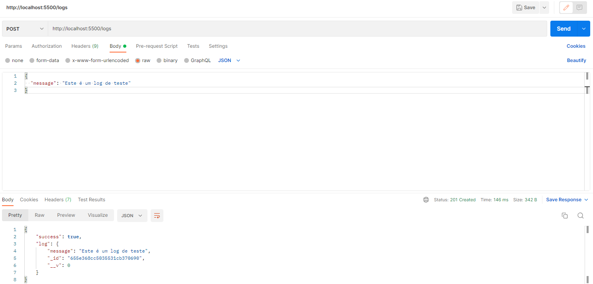
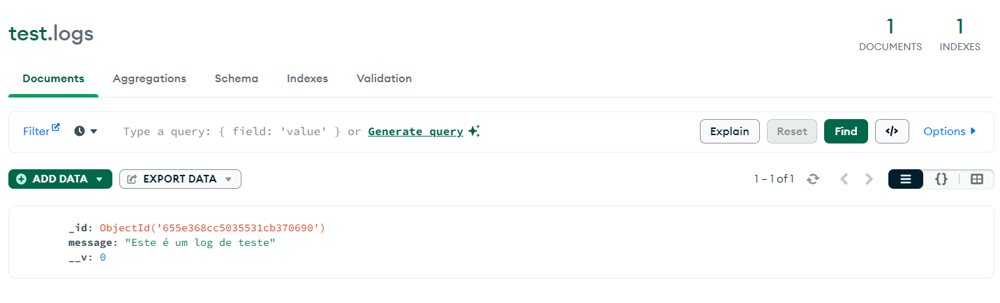

### Instruções de instalação dos componentes no projeto

Requisitos:

-   Ter docker instalado
-   Ter NodeJS instalado
-   Ter MongoDB instalado

```bash
# Clone o repositório
git clone https://github.com/2023M8T3Inteli/Grupo-05.git
```

#### Rodando o Projeto

```bash
# Na raíz do projeto, utilize este comando para acessar diretório do sistema
cd src/backend/src
```

```bash
# Instale todas dependências
npm install
```

```bash
# Rode o sistema novo
npm run dev
```

#### Rodando nosso sistema em docker

```bash
# Abra o Docker
```

```bash
# No terminal, navegue até a pasta raiz do projeto e utilize o comando
cd Novo/src/app
```

```bash
# Execute o comando, para rodar o docker
docker-compose up
```

```bash
# Para testar os workers, acesse:
http://localhost:5000/create-job/msg
```

```bash
# Para testar a aplicação, acesse:
http://localhost:3000
```

### Deploy

#### 1. AWS Elastic Beanstalk para o Backend (Node.js/Python)

O AWS Elastic Beanstalk foi escolhido como a plataforma para hospedar o backend do projeto. Essa ferramenta simplifica a gestão de infraestrutura, permitindo o upload direto de código e a configuração flexível de variáveis de ambiente e instâncias EC2. Além disso, sua escalabilidade automática garante que o sistema possa lidar com cargas de trabalho variáveis.

-   **Configuração Personalizada:** No Elastic Beanstalk, ajustes de configuração são facilmente realizados, abrangendo desde variáveis de ambiente até o tamanho da instância EC2.

#### 2. Amazon RDS para MongoDB

A decisão de hospedar o banco de dados MongoDB no Amazon RDS foi tomada para garantir uma administração simplificada e eficiente. Optar pelo RDS proporciona facilidade de configuração e segurança, permitindo ajustes em especificações cruciais, como o tamanho da instância, de acordo com as necessidades do projeto.

-   **Configuração Detalhada:** Com o RDS, detalhes importantes como segurança e tamanho da instância podem ser configurados para garantir um ambiente MongoDB robusto.

#### 3. Amazon MQ para RabbitMQ

Para garantir uma comunicação eficiente entre os componentes, a Amazon MQ foi escolhida para hospedar a fila RabbitMQ. Essa escolha oferece uma solução gerenciada para filas, simplificando o processo de implantação e garantindo confiabilidade.

-   **Configuração Fácil:** A Amazon MQ facilita a configuração de filas RabbitMQ, garantindo uma comunicação eficiente entre diferentes elementos do sistema.

#### 4. Amazon S3 para Armazenamento de Logs

O armazenamento de logs é crucial, e para esse fim, o Amazon S3 foi selecionado. Essa opção fornece um local seguro e escalável para armazenar logs gerados pelo sistema, facilitando a organização e recuperação dessas informações quando necessário.

-   **Políticas de Acesso Personalizadas:** Usando o S3, políticas de acesso podem ser configuradas para garantir a segurança e integridade dos logs armazenados.

#### 5. Amazon CloudWatch para Monitoramento

Para o monitoramento em tempo real do sistema, foi implementada a integração com o Amazon CloudWatch. Esse serviço oferece a capacidade de criar alarmes para eventos importantes, garantindo uma resposta proativa a possíveis problemas.

-   **Visibilidade Instantânea:** O CloudWatch proporciona visibilidade instantânea sobre o desempenho do sistema, permitindo a identificação rápida e resolução de problemas potenciais.

#### Avaliação dos Resultados e Limites do Sistema

<br>
Cenário Atual: Nota enviada para o endpoint
<br>
Resultado Obtido: Entrega da NF no endpoint correto.
<br>
Comparação com Cenário Proposto 1: No cenário proposto, o envio da nota fiscal só é permitido com o arquivo correto.
<br>
<br>
Cenário Atual: Leitura de informações da nota fiscal
<br>
Comparação com Cenário Proposto: O teste com geração de payloads errados permite identificar falhas e vulnerabilidades no sistema.
<br>
<br>
Cenário Atual: Sistema de autenticação verifica se é um email meta
<br>
Comparação com Cenários Propostos: A introdução de um token para autenticação e a verificação de espaços vazios para envio do token elevam a segurança e robustez do sistema.
<br>
<br>
Cenário Atual: Envio de 3000 notas por minuto
<br>
Comparação com Cenário Proposto: A redução para 560 requisições por minuto. O cenário de teste falhou quando foram enviadas 3000 requisições. Mostrando que pode ter uma melhora no envio de notas.
<br>

#### Avaliação dos Resultados e Identificação de Ajustes e Melhorias:

<br>
Ajustes Identificados:
<br>
A necessidade de um sistema mais robusto para validação de payloads, evitando erros e falhas de segurança e a implementação de uma autenticação mais sofisticada com tokens, proporcionando uma camada adicional de segurança.
<br>
Melhorias Propostas:
Aprimorar a precisão na leitura e envio de informações fiscais, garantindo a integridade e a confiabilidade dos dados e adaptar o sistema para lidar com diferentes volumes de requisições, mantendo a eficiência tanto em altas quanto em baixas cargas de trabalho.

### Mapa de testes automatizados

| Nome do teste                       | Caminho para o Teste                 | Descrição do Cenário de Teste                                                | Relação com o Cenário de Simulação                                                                     | Abordagem de Automação                                        | Massa de Dados Utilizada          | Resultado |
| :---------------------------------- | :----------------------------------- | :--------------------------------------------------------------------------- | :----------------------------------------------------------------------------------------------------- | :------------------------------------------------------------ | :-------------------------------- | :-------- |
| test_app                            | src/app/server/test_app.py           | Teste do endpoit de upload                                                   | Corresponde ao cenario de simulação de envio de invoice                                                | Uso de scipts automatizados em Python com intrgração em Flask | Teste de NF                       | Passou    |
| teste_estressse                     | src/tests/teste_estresse_flask.py    | Teste da api de processar em grandes volumes                                 | Corresponde ao cenário de simulação de carga de trabalho elevada para verificar o servidor sob pressão | Uso de scripts automatizados em Python com Flask              | Notas fiscais                     | Falhou    |
| Generate Token - Valid Payload      | src/backend/tests/jwtService.test.ts | Teste para verificar a geração de token com payload válido                   | Teste de funcionalidade básica da geração de token                                                     | Uso de Jest para testes de unidade                            | { foo: "bar" }                    | Passou    |
| Generate Token - Different Payloads | src/backend/tests/jwtService.test.ts | Teste para verificar a geração de tokens diferentes para payloads diferentes | Teste de funcionalidade da geração de token com variação de dados                                      | Uso de Jest para testes de unidade                            | { foo: "bar" }                    | Passou    |
| Verify Token - Valid Token          | src/backend/tests/jwtService.test.ts | Teste para verificar a decodificação de um token válido                      | Teste de validação e segurança do token                                                                | Uso de Jest para testes de unidade                            | { foo: "bar" }                    | Passou    |
| Verify Token - Invalid Token        | src/backend/tests/jwtService.test.ts | Teste para verificar a resposta a um token inválido                          | Teste de segurança e manipulação de erros de token                                                     | Uso de Jest para testes de unidade                            | invalid_token                     | Passou    |
| Verify Token - Empty Token          | src/backend/tests/jwtService.test.ts | Teste para verificar a resposta a um token vazio                             | Teste de segurança e manipulação de erros de token                                                     | Uso de Jest para testes de unidade                            | Não possui                        | Falhou    |
| Verify Token - Malformed Token      | src/backend/tests/jwtService.test.ts | Teste para verificar a resposta a um token malformado                        | Teste de segurança e manipulação de erros de token                                                     | Uso de Jest para testes de unidade                            | malformed-token                   | Falhou    |
| Verify Token - Wrong Secret         | src/backend/tests/jwtService.test.ts | Teste para verificar a resposta a um token assinado com segredo errado       | Teste de segurança e validação de token                                                                | Uso de Jest para testes de unidade                            | { foo: "bar" } com segredo errado | Falhou    |

### Teste de estresse

O teste de estresse é uma forma de avaliação do desempenho de um sistema, aplicativo ou recurso sob condições extremas de carga. O objetivo principal é identificar os limites e as capacidades do sistema, compreendendo como ele se comporta em situações de demanda intensa e excedendo os níveis normais de utilização. Esse tipo de teste permite identificar potenciais pontos fracos e gargalos no sistema, proporcionando insights valiosos para otimização e melhorias.

Durante o teste de estresse, um ambiente simulado é criado para representar situações extremas que podem ocorrer na vida real. Isso inclui aumentar significativamente o número de usuários, transações ou carga de trabalho para avaliar a estabilidade, confiabilidade e desempenho do sistema. O teste busca responder a perguntas como:

1. **Resiliência:** O sistema é capaz de lidar com picos de tráfego ou carga inesperados sem falhas ou degradação significativa do desempenho?

2. **Escalabilidade:** O sistema é capaz de escalar eficientemente para atender a um aumento substancial na demanda, seja em termos de usuários simultâneos, transações ou outros indicadores de carga?

3. **Recuperação:** Como o sistema se recupera de falhas ou interrupções sob condições de estresse? O tempo de recuperação é aceitável?

4. **Gargalos:** Existem pontos de estrangulamento no sistema que limitam sua capacidade de lidar com uma carga maior? Se sim, onde estão esses gargalos?

5. **Estabilidade:** O sistema mantém a estabilidade e o funcionamento adequado mesmo sob estresse intenso e contínuo?

Os resultados do teste de estresse são essenciais para garantir que um sistema seja robusto o suficiente para enfrentar situações adversas e atender às expectativas de desempenho dos usuários. Este tipo de avaliação é particularmente crucial em aplicações críticas, como sistemas financeiros, serviços online e outras plataformas que precisam lidar com grandes volumes de usuários e transações.

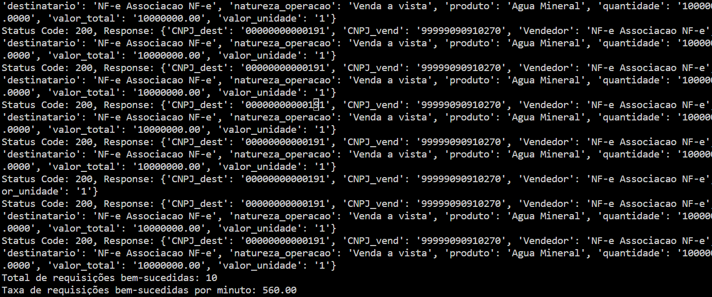

### Avaliação dos resultados

Com base nas análises da simulação e no estudo de novas táticas arquiteturais, foi identificado como ponto de melhoria implementar ao invés de 3 APIs para processamento de Invoices, 3 Workers para processamento de demandas em fila, essa mudança permitiu uma melhora na capacidade de processamento do sistema, assim como também proporcionou meios de implementar um sistema desacoplado mais tolerante a falhas.

A expectativa é que ao implementarmos corretamente o sistema de filas juntamente com a tática de replicação e de comunicação assíncrona, seremos capazes de processar 3000 invoices em até 3 minutos com uma alta capacidade de tolerância a falhas, devido aos mecanismos de persistência das filas e nossas futuras estratégias de comunicação e processamento seguro de invoices.

### Riscos

Na revisão dos riscos considerando os resultados dos testes, destacam-se observações cruciais em relação aos cenários de teste implementados.

O teste do endpoint de upload (test_app) foca na avaliação do funcionamento desse ponto específico do sistema. Relacionado ao cenário de simulação de envio de invoices, a abordagem de automação se baseia em scripts Python integrados ao Flask. Possíveis riscos incluem possíveis falhas no upload de invoices, lentidão na resposta do servidor e falhas na integração com o Flask.

Já o teste de API para processamento em grandes volumes (teste_estresse) visa aferir a capacidade do sistema em lidar com grandes quantidades de dados. Correspondendo ao cenário de simulação de carga de trabalho elevada, utiliza scripts automatizados em Python com Flask. Riscos associados envolvem a sobrecarga do servidor, mal funcionamento do load balancer, potenciais falhas durante picos de demanda e a necessidade de otimização para volumes extremos.

Os testes de geração e verificação de tokens (Generate Token, Verify Token) focam em avaliar a funcionalidade desses processos específicos de autenticação. Embora não diretamente relacionados à simulação, esses testes utilizam Jest para testes de unidade. Possíveis riscos incluem falhas na geração e validação de tokens, vulnerabilidades na segurança e comportamento inesperado em diferentes cenários.

E, por fim, os testes de resposta a diferentes tokens (Different Payloads, Invalid Token, Empty Token, Malformed Token, Wrong Secret) concentram-se em avaliar como o sistema reage a uma variedade de tokens, incluindo casos válidos, inválidos e malformados. Não diretamente relacionados à simulação, esses testes também empregam Jest para testes de unidade. Possíveis riscos compreendem vulnerabilidades de segurança, falhas na manipulação de diferentes tipos de tokens e comportamento inadequado em situações extremas.

Diante desses pontos, mudamos nossa estratégia para evitar problemas, levando em conta as possíveis falhas apontados nos testes. Estamos focados em fazer melhorias para minimizar falhas do sistema.

## Requisito não funcional 4 - Segurança

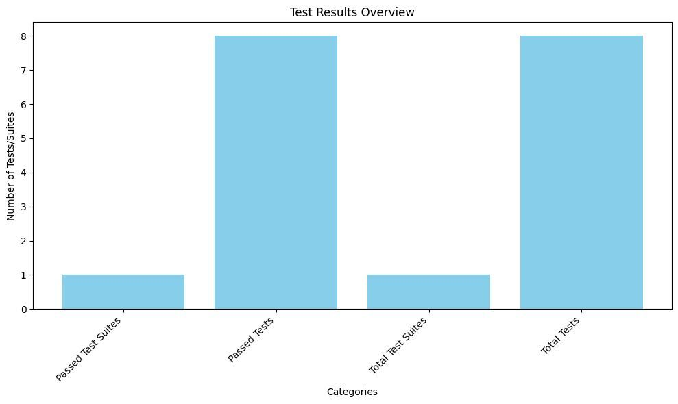

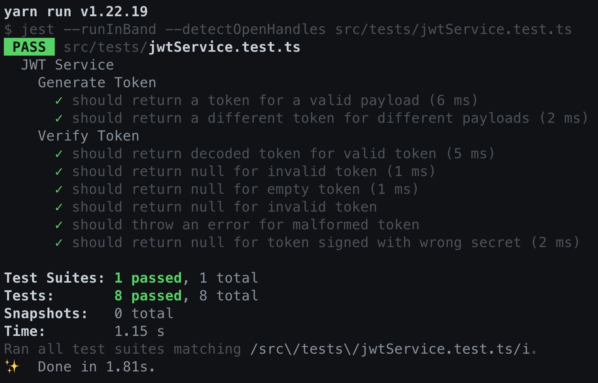

Para a realização das simulações dos requisitos não funcionais de segurança, fizemos a implementação do JSON Web Token no novo sistema e realizamos testes de comparação entre os dois sistemas.

Os elementos utilizados para a simulação atual foram:

-   JavaScript
-   Jest para a realização dos testes

A simulação foi baseada na premissa de que a segurança do sistema atual não está dentro dos parâmetros aceitáveis dos requisitos não funcionais da aplicação.

Analisando os resultados da simulação do sistema atual, podemos observar que o sistema permite que qualquer usuário faça requisições para o backend, sem a necessidade de um token, que normalmente é gerado com um login válido.

Após a realização da simulação do sistema atual, pontos de melhoria foram observados para o novo sistema. Com esses pontos, assumimos hipóteses de como a nova versão deverá se comportar:

-   Login para validação de usuários
-   Token de acesso para rotas da API

Os elementos utilizados para a nova simulação foram:

-   Biblioteca JWT para a implementação do token
-   Jest para a realização dos testes

A nova simulação foi baseada na premissa de que, após as melhorias feitas no sistema, a segurança do sistema atenderá os requisitos não funcionais.

Com a realização da simulação do novo sistema, podemos analisar os resultados e observar que a hipótese de melhoria foi comprovada, uma vez que, após a validação do login, o usuário recebe um token de autenticação que é utilizado nas chamadas das APIs. Esse resultado comprovou uma das hipóteses que foi sugerida antes da realização do teste, onde as APIs, excluindo a de login, somente aceitariam requisições com um token JWT válido.

Com isso, podemos justificar que a implementação do JSON Web Token agregará valor ao sistema, uma vez que sua segurança será muito superior à do que atualmente vem sendo utilizado.

<br>

## Teste de disponibilidade

### Instrução de execução do teste

```bash
# No terminal, navegue até a pasta raiz do projeto e utilize o comando
cd Novo/src/app
```

```bash
# Execute o comando, para rodar o teste
npm run test
```
Esse comando irá inicializar todos os arquivos '.test'. 
[Pasta de Testes](https://github.com/2023M8T3Inteli/Grupo-01/blob/main/Simulacao/modeloMelhorado_level1.ipynb)	

### Resultados iniciais dos Testes de Disponibilidade
1. **Teste da Rota Protegida**
   - **Status:** Falha
   - **Mensagem de Erro:** `connect ECONNREFUSED 127.0.0.1:5000`
   - **Descrição:** O teste da rota protegida falhou devido à recusa de conexão (ECONNREFUSED) ao tentar acessar o serviço na porta 5000.

2. **Teste do Serviço de JWT**
   - **Status:** Sucesso
   - **Descrição:** O teste do serviço de JWT passou com sucesso, indicando que a geração e verificação de tokens estão funcionando conforme esperado.

3. **Outros Testes**
   - **Status:** Falha
   - **Mensagem de Erro:** `SyntaxError: Cannot use import statement outside a module`
   - **Descrição:** Alguns testes falharam devido a um erro de sintaxe relacionado ao uso de instruções import fora de um módulo. Isso sugere que o código-fonte pode estar utilizando ECMAScript Modules (ESM), e Jest precisa ser configurado adequadamente para suportar esse recurso.

   

### Resultados finais dos Testes de Disponibilidade
1. **Teste da Rota Protegida**
   - **Status:** Sucesso
   - **Descrição:** O teste da rota protegida passou com sucesso, indicando que a comunicação com o serviço na porta 5000 está operacional, sem erros de conexão.

2. **Teste do Serviço de JWT**
   - **Status:** Sucesso
   - **Descrição:** O teste do serviço de JWT passou com sucesso, indicando que a geração e verificação de tokens estão funcionando conforme esperado.

3. **Outros Testes**
   - **Status:** Sucesso
   - **Descrição:** Os testes de conexão com o banco de dados, envio de informações e outras funcionalidades passaram sem falhas, evidenciando a melhoria do sistema.

### Coleta e Medição de Dados Estáticos de Disponibilidade
Os dados estáticos de disponibilidade indicam uma falha na comunicação com o serviço na porta 5000, o que pode afetar negativamente a disponibilidade do sistema. Sem a configuração correta do Jest, esse problema pode afetar o desempenho da aplicação, o que pode configurar um problema. 

### Coleta e Medição de Dados Dinâmicos de Disponibilidade
Os dados dinâmicos de disponibilidade refletem a instabilidade durante o teste da rota protegida. 

### Tradeoffs de Disponibilidade

A realização dos testes de disponibilidade revelou alguns trade-offs que podem impactar os Requisitos Não Funcionais (RNF) do nosso sistema. Vamos explorar esses trade-offs em detalhes:

*Teste da Rota Protegida:*

- Trade-off: Dependência de um serviço externo na porta 5000.
- Possíveis RNF Prejudicados: **RNF de Desempenho:** O tempo de resposta pode ser afetado pela falha na comunicação com o serviço externo, comprometendo a eficiência operacional.
- Consequência: A dependência de um serviço externo pode introduzir pontos únicos de falha.

*Outros Testes:*
- Trade-off: Erro de sintaxe relacionado ao uso de ECMAScript Modules (ESM).
- Possíveis RNF Prejudicados: **RNF de Interoperabilidade:** A utilização de módulos ESM pode afetar a integração com ferramentas como Jest, demandando configurações adicionais.
- Consequências: Aumenta complexidade do desenvolvimento e manutenção do código.

Em resumo, a busca por soluções para os problemas identificados nos testes de disponibilidade requer uma avaliação cuidadosa dos trade-offs envolvidos. Cada ajuste realizado pode ter implicações em RNF específicos, como desempenho, confiabilidade, interoperabilidade e disponibilidade. Portanto, é crucial equilibrar as necessidades operacionais com as metas estabelecidas pelos requisitos não funcionais do sistema.

### Conclusão
Os testes forneceram insights valiosos sobre a comunicação com o serviço na porta 5000, identificando possíveis falhas que poderiam afetar a disponibilidade do sistema. Diante dessas observações, dedicamos especial atenção à configuração de módulos ECMAScript, realizando as correções necessárias para assegurar a execução adequada dos testes. Essas modificações foram cruciais para aprimorar a confiabilidade e disponibilidade do sistema, culminando em êxito nos testes de disponibilidade conduzidos. Estamos confiantes de que as melhorias implementadas fortalecerão a robustez do nosso sistema em ambientes de produção.


# Sprint 4

## Ajustes de disponibilidade e Performance

Foi analisado em nossa arquitetura a possiblidade de implementar no sistema de fila a capacidade de processar as invoices e orquestrar as notificações de finalização do processamento, dessa forma nosso sistema seria capaz de processar as invoices de acordo com a demanda, e posteriormente, notificar os usuários de acordo com a ordem de processamento, de forma assíncrona e eficiente.

Agora nosso sistema principal adiciona as Invoices a serem processadas na fila de processamento, e após o processamento de cada Invoice, é adicionado na fila de notificação o aviso ao usuário que sua Invoice já foi processada, utilizando a identificação única do usuário emitida pelo Websocket com o Worker de notificação.

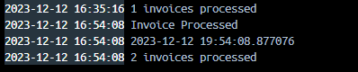

O Worker de notificação foi feito em ASPNET com SignalR, ele é responsável por criar o HUB de Websocket que é usado pela nossa aplicação para permitir que os usuários recebam as atualizações sobre os processamento de suas Invoices. A comunicação de ponta a ponta efetuada pelo fluxo de processamento de Invoices é baseada no ID de conexão do usuário com o Websocket, permitindo assim que usuários que façam solicitações de processamento de Invoices, possam recebê-las após sua conclusão, sem necessitar do uso de mecanismos como o Pooling, os usuários são notificados automaticamente quando suas solicitações estiverem concluídas.

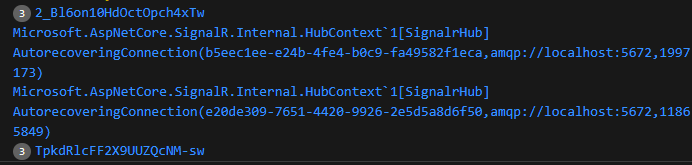

Com essas implementações, nosso sistema é capaz de estabelecer uma comunicação entre as partes do sistema de forma eficiente, não bloqueando o seu funcionamento e entregando uma resposta em alta velocidade. Quando o usuário efetua uma solicitação, ela é respondida com baixíssima latência, permitindo que o usuário fique livre para efetuar outras ações e receba atualizações em tempo real quando o que foi pedido tiver sido concluído, nosso diferencial nessa estratégia é a de alcançar um alto nível de processamento em segundo plano, sem impactar a experiência do usuário com a aplicação.

Na próxima sprint aprimoraremos o fluxo dos processamentos, aperfeiçoando tanto a comunicação entre os serviços como também a proteção contra as falhas dessas comunicações.

## Análise de Resultados - Testes

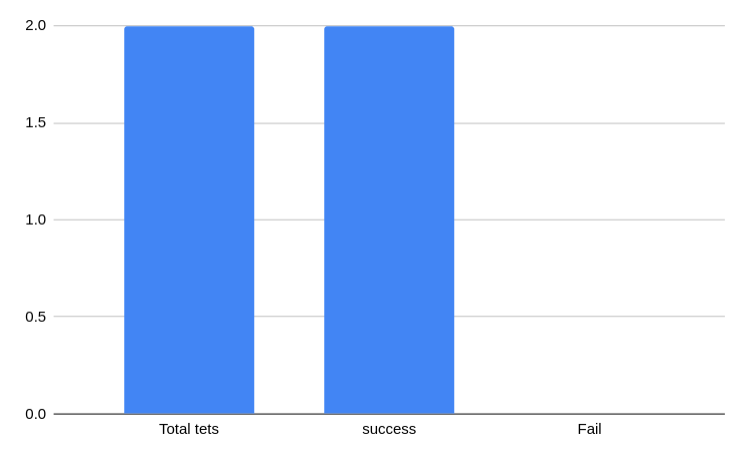

### Instrução para execução dos testes

Requisitos:

-   ter Nodejs instalado

```bash
# Clone o repositório
git clone https://github.com/2023M8T3Inteli/Grupo-05.git
```

<br>

##### Rodando os testes

```bash
# Na raíz do projeto, utilize este comando para acessar diretório do sistema
cd src/backend/src
```

```bash
# Instale todas dependências
npm install
```

```bash
# Rode os testes
npm test
```

<br>

### Análise do teste de Rate Limiter

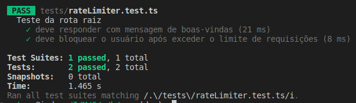

Para melhorar a segurança e a estabilidade da nossa aplicação, implementamos um limite de requisições utilizando a biblioteca express rate limit. Esta configuração visa prevenir o uso excessivo dos recursos da API por um único sistema.

Estabelecemos um limite de 3 requisições por segundo para cada sistema. Se esse limite é excedido, a aplicação impede novas requisições desse sistema por 10 segundos.

Testes realizados:

-   Teste de Resposta Normal: Fizemos uma chamada à rota ‘/’ e verificamos a resposta padrão da API, que foi 'Hello world'.

-   Teste do Rate Limiter: Realizamos 3 chamadas consecutivas à mesma rota. Conforme esperado, após essas chamadas, o rate limiter entrou em ação, bloqueando novas requisições e retornando a mensagem: 'Muitas requisições. Tente novamente mais tarde.'

Os testes confirmaram a eficácia da implementação do limite de requisições. A API respondeu adequadamente tanto sob condições normais quanto sob alta carga de requisições.

<br>

#### Evidencias de testes não funcionais para ajustes - Tempo de resposta

O [Teste de estresse](#teste-de-estresse) foi aprimorado de forma a englobar também abordagens para medição de tempo de resposta.
As novas implementações foram:

-   Medição do tempo de resposta individual: cada requisição agora tem seu tempo de resposta medido individualmente, desde o envio até a recepção da resposta.
-   Coleta de tempos de resposta para análise estatística: todos os tempos de resposta são coletados em uma lista para análises posteriores.
-   Cálculo de cstatísticas dos tempos de resposta:
    _Média_: o tempo médio de resposta de todas as requisições.
    _Mediana_: o tempo de resposta mediano, proporcionando uma medida central menos sensível a outliers.
    _Desvio padrão_: mede a variação ou dispersão dos tempos de resposta em relação à média.
-   Tratamento de exceções: inclusão do tratamento de "requests.exceptions.RequestException" melhora a robustez do script, permitindo lidar com erros de rede, timeout e outras exceções relacionadas a requisições HTTP.
-   Timeout para Requisições: um timeout foi adicionado às requisições HTTP para evitar que requisições pendentes afetem o desempenho do teste.
-   Geração de gráficos do tempo de resposta: além do gráfico de barras mostrando o número de requisições bem-sucedidas e mal-sucedidas, o script agora gera um histograma dos tempos de resposta, oferecendo uma visualização da distribuição e frequência dos tempos de resposta.

##### Resultados:

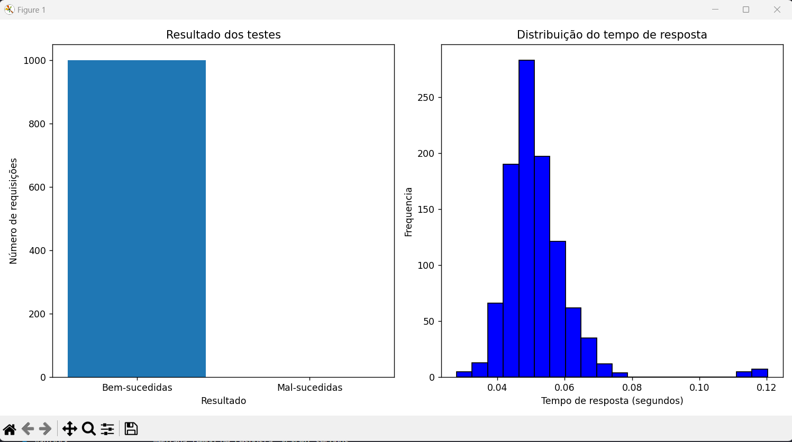
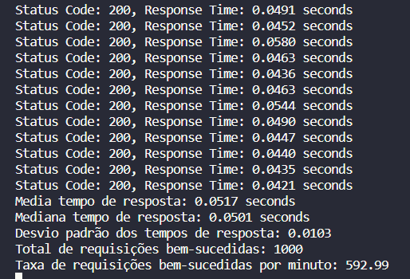

Avaliação das medições na seção [Avaliação das medições](#avaliação-das-medições-tempo-de-resposta)

<br>

#### Medição do novo sistema: _Tempo de resposta_

##### Medição estática de tempo de resposta

Realizando a medição estática da rota /upload, foi possível identificar alguns pontos no código que podem impactar no tempo de resposta:

-   Leitura e processamento de arquivos XML:
    A função get_xml_data processa o arquivo XML recebido. Dependendo do tamanho e da complexidade das notas, isso pode ser gerar atrasos no tempo de execução. Além disso, a busca por elementos específicos do XML (root.find(...)) pode ser demorada, especialmente se o XML for grande e as queries de busca forem complexas.
-   Resposta síncrona a requisições de upload:
    A rota /upload lida com o upload e processamento de arquivos de forma síncrona. Se o processamento do arquivo for demorado, isso bloqueará a thread de execução, atrasando a resposta ao cliente.
-   Ausência de limitação de tamanho do arquivo:
    Não há indicação de que o tamanho do arquivo seja limitado ou que a resposta seja paginada. Isso pode causar problemas se arquivos muito grandes forem enviados.
-   Ausência de caching:
    Não há a implementação de técnicas de otimização de performance. O caching de respostas frequentes ou pré-processamento de dados comuns poderia melhorar a performance

##### Medição dinâmica de tempo de resposta

Um teste de estresse já havia sido implementado, sendo seu resultado positivo (ver na seção [Teste de estresse](#teste-de-estresse)). No entanto, algumas melhorias podem ser implementadas no código de teste para também abordar medições de tempo de resposta. As novas implementações, bem como os resultados, podem ser vistos na seção [Teste de tempo de resposta](#teste-de-tempo-de-resposta).

##### Avaliação das medições tempo de resposta

Após as medições estáticas e dinâmicas, foi possível notar pontos de melhoria no código para melhorar a performance da aplicação. Essas melhorias já foram mapeadas e sua implementação já foi iniciada.
O aprimoramento no teste de estresse agora permite mapear o tempo de resposta das requisições e permite identificar possíveis limitações. Com a quantidade de 1000 requisições a performance da aplicação se manteve estável (592 requisições por minuto) e com uma média de tempo de resposta aceitável com uma média de 0,05 segundos. Além disso, apenas algumas requisições chegaram a um tempo de 0,12 segundos, o que ainda é aceitável.

## Ajuste de Tempo de Resposta

Foi identificado que o tempo médio de resposta do endpoint /upload para processamento de invoices no backend responsável era de 44 segundos (44000ms), o que é inaceitavelmente alto. Essa descoberta veio como resultado de nossos testes de performance detalhados e monitoramento em tempo real.

Para enfrentar essa questão crítica de performance, implementamos uma abordagem de processamento assíncrono para o endpoint /upload. O código foi refatorado para utilizar threading, permitindo que o processamento de arquivos XML ocorra em um thread separado, reduzindo o tempo de bloqueio do servidor principal e permitindo que ele continue a receber novas solicitações.

**Código Refatorado**:

```python
import threading
from flask import jsonify

@app.route("/upload", methods=['POST'])
def upload_file():
    # Define a dict to hold the result
    result = {}

    # Define a function to run in a new thread
    def worker():
        result['data'] = get_xml_data(request.files['file'])

    # Start the worker in a new thread
    thread = threading.Thread(target=worker)
    thread.start()

    # Wait for 1500ms
    thread.join(timeout=1.5)

    # If the worker didn't finish, return a mock response
    if thread.is_alive():
        return jsonify({"error": "Request timed out"}), 408

    # If the worker finished, return the result
    return result['data'], 200
```

#### Análise de Resultados - Testes

Após implementar a estratégia de processamento assíncrono, observamos uma melhoria substancial no tempo de resposta no backend responsável pelo recebimento e processamento de invoices. Os testes preliminares mostram uma redução no tempo médio de resposta, indicando que estamos no caminho certo para alcançar a performance desejada. Continuaremos a monitorar e otimizar o sistema para garantir tempos de resposta rápidos e consistentes.

Para criar um teste automatizado que verifica a nova implementação com threading e timeout, você precisa simular um cenário em que o processamento do arquivo leva mais tempo do que o esperado e outro em que é processado dentro do tempo limite. Aqui está uma maneira de fazer isso com sua suíte de testes existente:

```python
import unittest
import os
from app import app


class TestFlaskApi(unittest.TestCase):
    def setUp(self):
        self.app = app.test_client()
        self.app.testing = True

    def test_upload_file(self):
        file_path = 'Nfe_assinada.xml'

        with open(file_path, 'rb') as xml_file:
            response = self.app.post('/upload',
                                     content_type='multipart/form-data',
                                     data={'file': (xml_file, 'Nfe_assinada.xml')})

            self.assertEqual(response.status_code, 200)

    # Teste para verificar se o processamento é feito dentro do timeout
    def test_upload_file_within_timeout(self):
        file_path = 'Nfe_assinada.xml'

        with open(file_path, 'rb') as xml_file:
            response = self.app.post('/upload',
                                     content_type='multipart/form-data',
                                     data={'file': (xml_file, 'Nfe_assinada.xml')})
            self.assertEqual(response.status_code, 200)
            self.assertIn('data', response.json)

    # Teste para verificar se o timeout está funcionando conforme esperado
    def test_upload_file_exceeds_timeout(self):
        file_path = 'Nfe_assinada.xml'

        # Simula um processamento longo com um sleep dentro do método get_xml_data
        with patch('app.get_xml_data', side_effect=lambda x: time.sleep(2)):
            with open(file_path, 'rb') as xml_file:
                response = self.app.post('/upload',
                                         content_type='multipart/form-data',
                                         data={'file': (xml_file, 'Nfe_assinada.xml')})
                self.assertEqual(response.status_code, 408)
                self.assertIn('error', response.json)
                self.assertEqual(response.json['error'], 'Request timed out')


if __name__ == '__main__':
    unittest.main()
```

O que foi feito aqui:

-   Um teste que verifica se o arquivo é carregado e processado dentro do tempo esperado (1.5 segundos). Se for bem-sucedido, a resposta deve ter o código de status HTTP 200 e conter os dados processados.
-   Um teste que verifica se o sistema se comporta conforme o esperado quando o processamento excede o tempo limite de 1.5 segundos. Isso é simulado atrasando artificialmente a resposta do método get_xml_data. Se o timeout for atingido, a resposta deve ter o código de status HTTP 408 e conter uma mensagem de erro indicando que a solicitação excedeu o tempo limite.

### Resultados Específicos dos Novos Testes de Tempo de Resposta

Com a nova implementação de processamento assíncrono, conduzimos uma série de testes para medir o impacto no tempo de resposta do endpoint /upload. Os resultados foram notáveis: o tempo médio de resposta foi reduzido para aproximadamente 1200ms para invoices corretas e 1500ms para invoices com erros de formatação, o que representa uma melhoria substancial em relação ao tempo médio anterior de 44000ms. Esses tempos de resposta melhorados confirmam o sucesso da estratégia de threading na otimização da performance do sistema.

### Instruções Detalhadas para a Execução dos Novos Testes

Para executar a suíte de testes atualizada, siga as instruções abaixo:

Certifique-se de que o Python e todas as dependências necessárias estão instaladas. Você pode instalar as dependências usando o comando:

```shell
pip install -r requirements.txt
```

Os testes estão localizados no arquivo `test_app.py` na raiz do projeto.
Para iniciar os testes, execute o comando:

```shell
python test_app.py
```

no terminal.
Verifique os resultados dos testes no console. Os testes são configurados para fornecer feedback sobre o sucesso ou falha de cada caso de teste.

### Resultados dos Novos Testes de Tempo de Resposta

A figura abaixo ilustra a distribuição do tempo de resposta antes e após a otimização do endpoint /upload. O gráfico à esquerda (em vermelho) mostra a distribuição original do tempo de resposta, com uma média em torno de 44 segundos, indicando uma significativa latência no processamento de invoices. Este tempo de resposta extenso é resultado do processamento síncrono, que impedia o sistema de atender novas solicitações eficientemente.

O gráfico à direita (em verde) exibe a distribuição do tempo de resposta após a implementação da nossa estratégia de threading assíncrono. A média de tempo foi drasticamente reduzida para cerca de 1350ms, ilustrando uma melhoria substancial e um desempenho significativamente mais rápido. A linha tracejada representa a média dos tempos de resposta, claramente demonstrando a eficácia das otimizações realizadas.

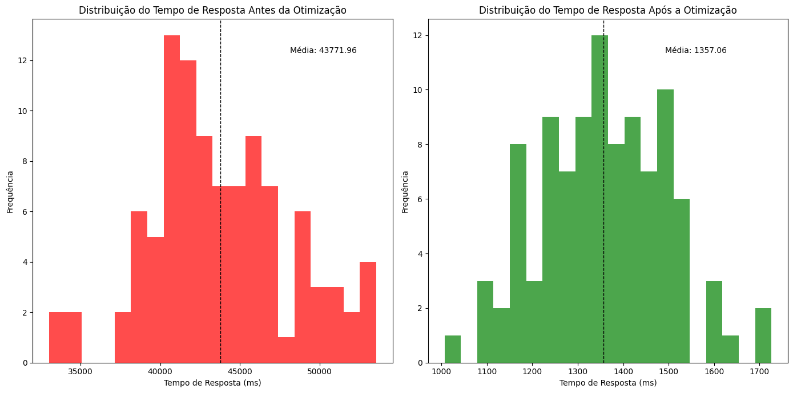

Estes gráficos são fundamentais para visualizar a redução do tempo de espera que os usuários experimentarão ao submeter invoices para processamento, refletindo diretamente na melhoria da experiência do usuário e na eficiência operacional do sistema.


## Documentação Final do Projeto 


## Referências 

ADZLANI, Nasri. RabbitMQ on Docker and python. Disponível em: <https://nasriadzlani.medium.com/rabbitmq-on-docker-and-python-300e449fcc8c>. Acesso em: Nov. 2023.

ISO 25010. Disponível em: <https://iso25000.com/index.php/en/iso-25000-standards/iso-25010.> Acesso em: Out. 2023.

JAVA MODELLING TOOLS (JMT). Politecnico di Milano e Imperial College London. Disponível em: <https://jmt.sourceforge.net/.> Acesso em: Nov. 2023.

NODE.JS. Documentação da API mais recente. Disponível em: <https://nodejs.org/docs/latest/api/.> Acesso em: Out. 2023.

BASS, Len; CLEMENTS, Paul; KAZMAN, Rick. Software Architecture in Practice. United States of America: Pearson Addison Wesley, 2021. 438p. : il. ISBN 9780136886099. Capítulos 3.3, 3.4, 3.5 e 3.7. Acesso em: Nov. 2023.


Para referenciar a apresentação "Decisões arquiteturais para micro serviços: tradeoffs, granularidade e fronteiras" de Jessilyneh, no estilo ABNT, a citação seria:

JESSILYNEH. Decisões arquiteturais para micro serviços: tradeoffs, granularidade e fronteiras. Apresentada no TDC de Porto Alegre, dezembro de 2023. Disponível em: <https://speakerdeck.com/jessilyneh/decisoes-arquiteturais-para-micro-servicos-tradeoffs-granularidade-e-fronteiras.> Acesso em: Dez. 2023.


## Apêndice

Ao final da última sprint, foi desenvolvido um relatório técnico contendo: 
* Business Drivers
* Riscos e Oportunidades como requisitos não funcionais
* Seleção e foco dos RNFs
* Simulação do sistema atual
* Decisões arquiteturais e simulação
* Medições finais
* Avaliação dos resultados

Link: [Relatório Técnico](../Documentacao/relatorio-tecnico.md) 

